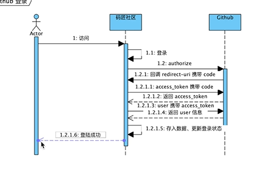

## spring boot项目

## 资料
- [B站视频](https://www.bilibili.com/video/BV1r4411r7au?p=4)
- [spring官网文档](https://spring.io/guides)
- [spring web](https://spring.io/guides/gs/serving-web-content/)
- [bootstrp](https://v3.bootcss.com/components/#navbar)
- [oauth](https://developer.github.com/apps/building-oauth-apps/creating-an-oauth-app/)
  - [配置说明](https://docs.github.com/en/developers/apps/authorizing-oauth-apps) 
  - [oauth个人配置](https://github.com/settings/applications/1622583)
- [okhttp](https://square.github.io/okhttp/)

## 工具
- [git](https://git-scm.com/download)
- [visual-paradigm](https://www.visual-paradigm.com)

## 参考网站
- https://elasticsearch.cn/explore

## 资料
- [spring官网资料](https://docs.spring.io/spring-boot/docs/2.0.0.RC1/reference/htmlsingle/#boot-features-embedded-database-support)
- [spring boot mybatis外网](https://www.mybatis.org/spring-boot-starter/mybatis-spring-boot-autoconfigure/)
## 时序图

